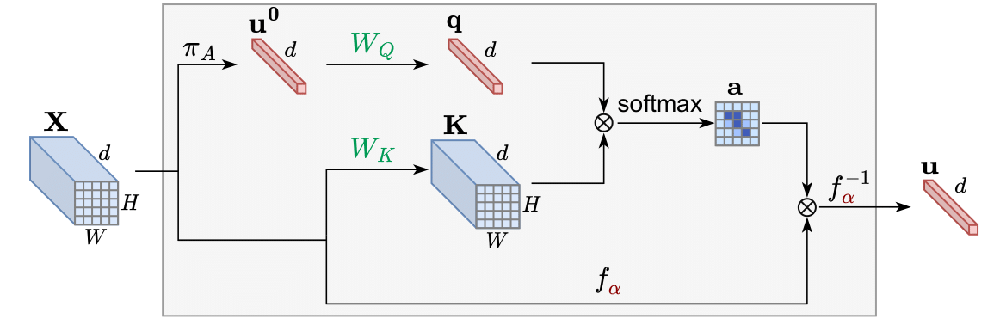
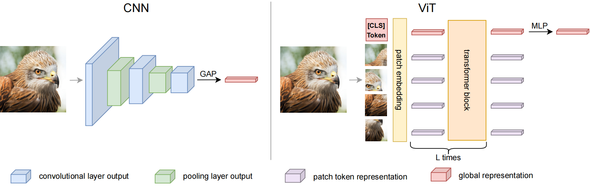
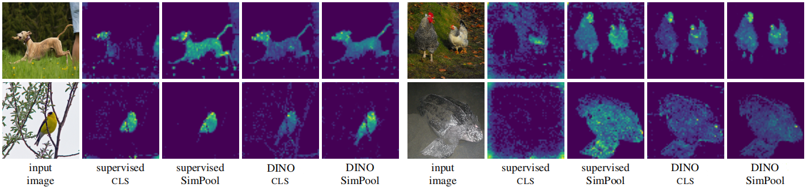
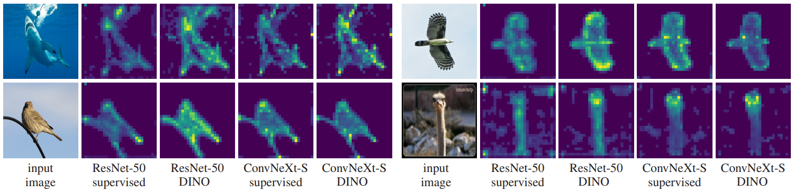

# Keep It SimPool: Who Said Supervised Transformers Suffer from Attention Deficit?
Official PyTorch implementation and pretrained models for ICCV 2023 SimPool. [[`arXiv`](https://arxiv.org/abs/2309.06891)], [[`paper`](https://openaccess.thecvf.com/content/ICCV2023/html/Psomas_Keep_It_SimPool_Who_Said_Supervised_Transformers_Suffer_from_Attention_ICCV_2023_paper.html)], [[`poster`](http://users.ntua.gr/psomasbill/SimPool_ICCV2023_Poster.pdf)]

<div align="center">
  
</div>

## Overview
### Motivation
- Convolutional networks and vision transformers have different forms of pairwise interactions, *pooling across layers* and *pooling at the end of the network*. Does the latter really need to be different:question: What would happen if we completely discarded the [CLS]:question:

<div align="center">
  
</div>

- As a by-product of pooling, vision transformers provide spatial attention for free, but this is most often of *low quality* unless self-supervised, which is not well studied. Is supervision really the problem:question: Can we obtain high-quality attention maps in a supervised setting:question:

<!---In this work, we develop a *generic pooling framework* and then we formulate a number of existing methods as instantiations. By discussing the properties of each group of methods, we derive *SimPool*, a simple attention-based pooling mechanism as a replacement of the default one for both convolutional and transformer encoders. We find that, whether *supervised* or *self-supervised*, this improves performance on pre-training and downstream tasks and provides attention maps *delineating object boundaries* in all cases.
One could thus call SimPool *universal*. To our knowledge, we are the first to obtain attention maps in supervised transformers of at least as good quality as self-supervised, without explicit losses or modifying the architecture.
--->

### Approach
We introduce SimPool, a simple attention-based pooling method at the end of network, obtaining clean attention maps under supervision or self-supervision, for both convolutional and transformer encoders. 

- Attention maps of ViT-S on ImageNet-1k: 
<div align="center">
  
</div>
Note that when using SimPool with Vision Transformers, the [CLS] token is *completely discarded*. 

- Attention maps of ResNet-50 and ConvNeXt-S on ImageNet-1k: 
<div align="center">
  
</div>

> :loudspeaker: **NOTE: Considering integrating SimPool into your workflow?**  
> Use SimPool when you need high quality attention maps, delineating object boundaries.
> Use SimPool as an alternative pooling mechanism. It's super easy to try!

## Integration
SimPool is by definition plug and play. 

To integrate `SimPool` into any architecture (convolutional network or transformer) or any setting (supervised, self-supervised, etc.), follow the steps below:


### 1. Initialization (`__init__` method):
```python
from sp import SimPool

# this part goes into your model's __init___()
self.simpool = SimPool(dim, gamma=2.0) # dim is depth (channels)
```

>:exclamation: **NOTE: Remember to adapt the value of gamma according to the architecture. In case you don't want to use gamma, leave the default gamma=None.**

### 2. Model Forward Pass (`forward` method):

Assuming input tensor `X` has dimensions: 

- (B, d, H, W) for convolutional networks
- (B, N, d) for transformers, where:

B = batch size,
d = depth (channels),
H = height of the feature map, 
W = width of the feature map,
N = patch tokens

```python
# this part goes into your model's forward()
cls = self.simpool(x) # (B, d)
```

>:exclamation: **NOTE: Remember to integrate the above code snippets into the appropriate locations in your model definition**.

## Installation
We provide experiments on [ImageNet](https://imagenet.stanford.edu/) in both supervised and self-supervised learning. Thus, we use two different [Anaconda](https://www.anaconda.com/distribution/#download-section) environments, both utilizing [PyTorch](https://pytorch.org/). For both, you will first need to [download ImageNet](https://medium.com/@billpsomas/download-and-prepare-imagenet-401bf10a681).

### Self-supervised learning environment

```bash
conda create -n simpoolself python=3.8 -y
conda activate simpoolself
pip3 install torch==1.8.0+cu111 torchvision==0.9.0+cu111 -f https://download.pytorch.org/whl/torch_stable.html
pip3 install timm==0.3.2 tensorboardX six
```

### Supervised learning environment

```bash
conda create -n simpoolsuper python=3.9 -y
conda activate simpoolsuper
conda install pytorch torchvision torchaudio pytorch-cuda=11.7 -c pytorch -c nvidia
pip3 install pyyaml
```

## Acknowledgement

This repository is built using [Attmask](https://github.com/gkakogeorgiou/attmask), [DINO](https://github.com/facebookresearch/dino), [ConvNeXt](https://github.com/facebookresearch/ConvNeXt), [DETR](https://github.com/facebookresearch/detr), [timm](https://github.com/huggingface/pytorch-image-models) and [Metrix](https://github.com/billpsomas/Metrix_ICLR22) repositories.

[NTUA](https://www.ntua.gr/en/) thanks [NVIDIA](https://www.nvidia.com/en-us/) for the support with the donation of GPU hardware. [Bill](http://users.ntua.gr/psomasbill/) thanks [IARAI](https://www.iarai.ac.at/) for the hardware support.

## License
This repository is released under the Apache 2.0 license as found in the [LICENSE](LICENSE) file.

## Citation
If you find this repository useful, please consider giving a star :star: and citation:
```
@InProceedings{psomas2023simpool,
    author    = {Psomas, Bill and Kakogeorgiou, Ioannis and Karantzalos, Konstantinos and Avrithis, Yannis},
    title     = {Keep It SimPool: Who Said Supervised Transformers Suffer from Attention Deficit?},
    booktitle = {Proceedings of the IEEE/CVF International Conference on Computer Vision (ICCV)},
    month     = {October},
    year      = {2023},
    pages     = {5350-5360}
}
```
